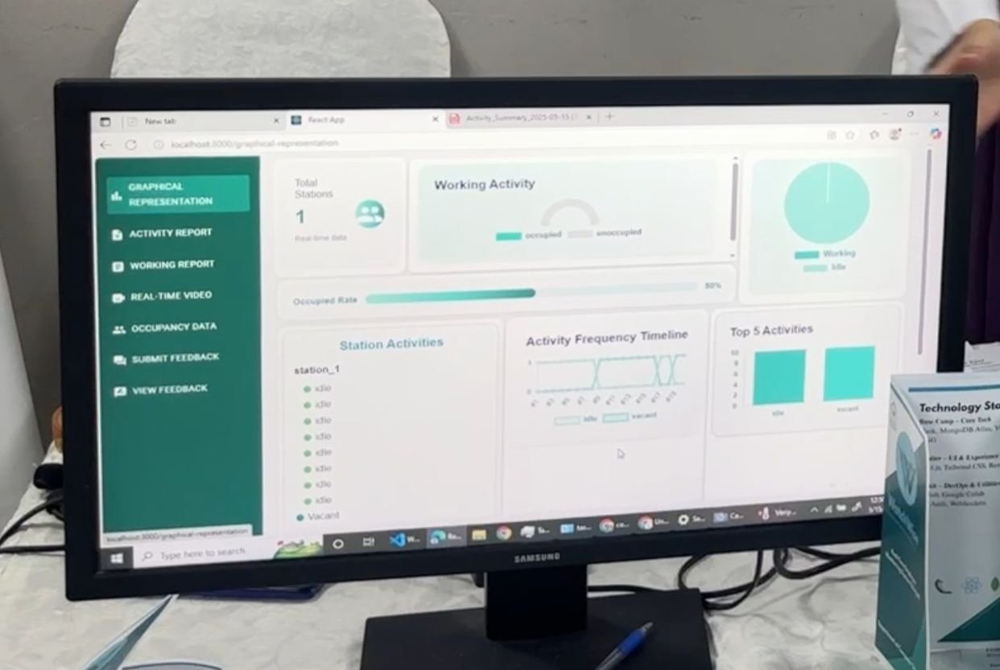

# WatchWise
WatchWise is a real time AI-powered employee monitoring system that tracks workstation occupancy and human activities to calculate working hours. It leverages advanced computer vision techniques using YOLOv8 and VGG16, integrated with an OAK-D camera for live analysis.

## Features
- Real time human detection with YOLOv8
- Activity recognition (e.g., working, eating, idle) using VGG16
- Smart workstation occupancy tracking
- Automated working hours calculation
- Interactive dashboard with React
- Flask-based backend with MongoDB
- OAK-D camera integration for real-time input

## Technologies Used

- **Frontend:** React.js  
- **Backend:** Flask, MongoDB, FASTApi  
- **Deep Learning Models:** YOLOv8, VGG16 (TensorFlow)  
- **Realtime Input:** WebCam
- **Communication:** Socket.IO
- 

